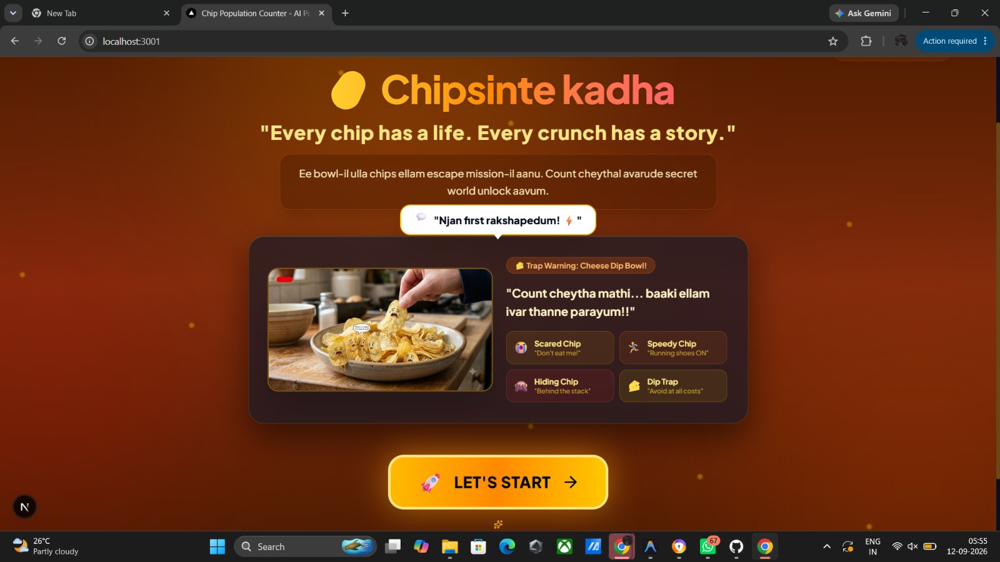
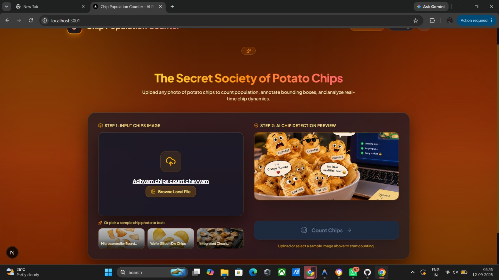
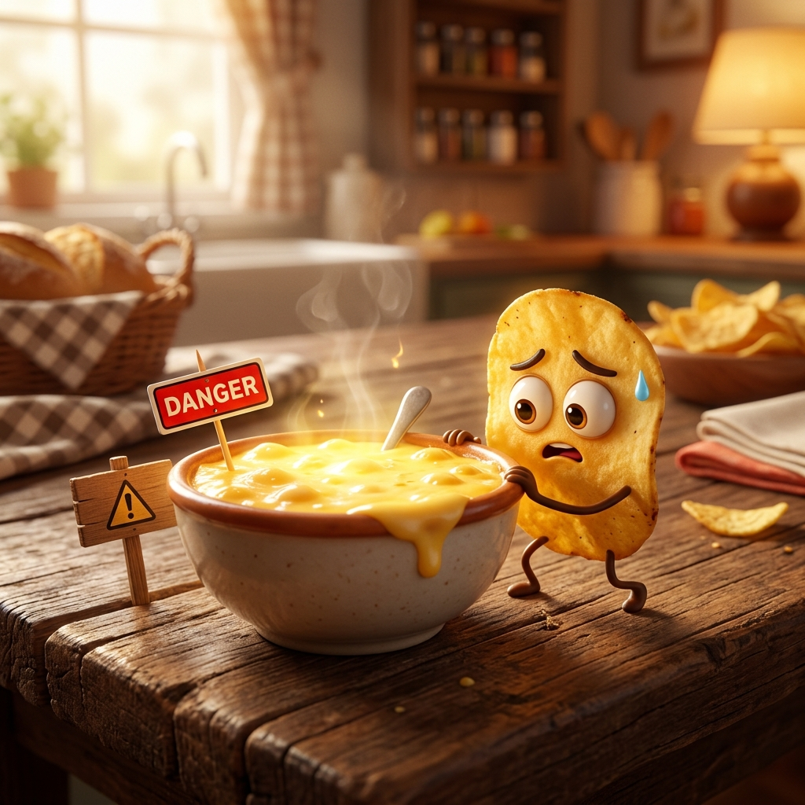
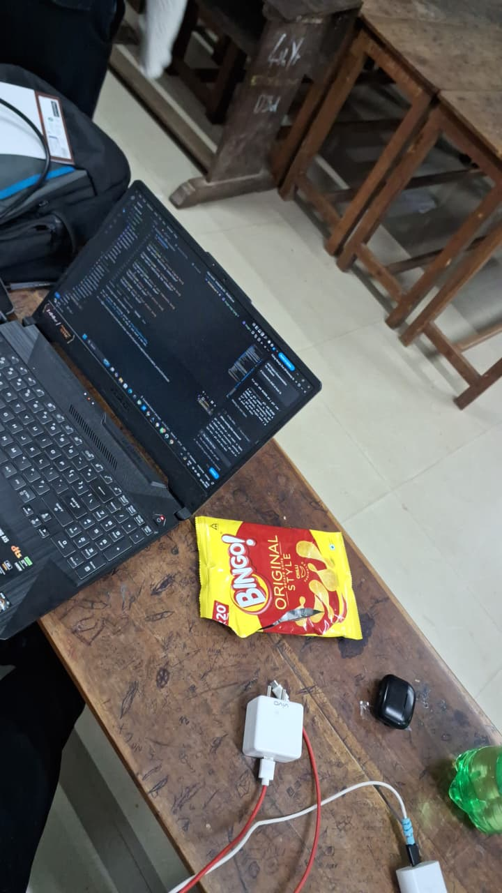
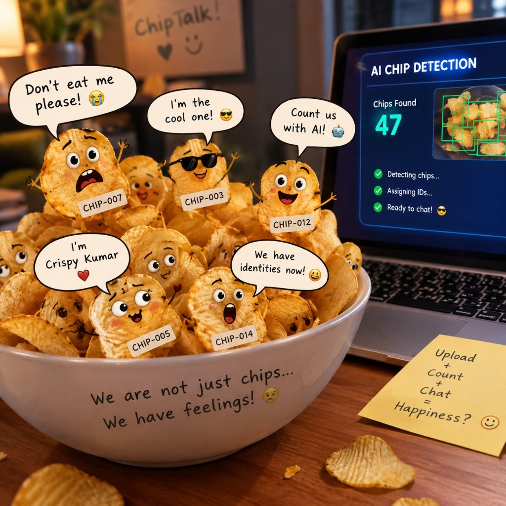

# [Project Name] 🎯


## Basic Details
### Team Name: [Devu Suresh]


### Team Members
- Team Lead:Devu Suresh - RIT Kottayam
- Member 2: Devu Suresh - RIT Kottayam
- Member 3: Archana V - RIT Kottayam

### Project Description
Chipsintte kadha is a full-stack AI web app built with Next.js and FastAPI. It uses computer vision (Grounding DINO & OpenCV) to detect, count, and generate funny social demographic profiles (personalities, bios, jobs) for every potato chip in an uploaded photo. Ready for Vercel deployment!

### The Problem (that doesn't exist)
Humanity suffers from severe "Snack Anxiety" and an unaddressed crisis of Chip Demographics. Millions of people open chip bags every day completely unaware of the rich social hierarchies, relationship dramas, and career burnout unfolding inside their bowl. Chips are being tragically eaten without full civil representation, background checks, or census tracking!

### The Solution (that nobody asked for)

Chipsintte kadha — an AI-powered Chip Census Bureau using zero-shot Grounding DINO vision neural networks to inspect every chip in your bowl. We automatically generate a full digital civil profile for every crisp, assigning legally binding names (e.g. Nacho Nathan), job titles (Chief Crunch Officer), moods (Floating in Salsa), and relationship statuses (Single & Crispy) before you take a bite, complete with celebratory confetti cannons!
## Technical Details

### Technologies/Components Used
For Software:
-Languages used: JavaScript (ES6+), Python 3.10+
Frameworks used: Next.js 16 (React 19), FastAPI, Tailwind CSS
Libraries used: OpenCV (opencv-python-headless), PyTorch & Hugging Face Transformers (Grounding DINO), Pillow, python-multipart, Lucide React, Canvas Confetti
Tools used: Vercel Serverless Functions, Git, GitHub, Uvicorn, npm


### Implementation

# Installation
```bash
# 1. Clone the repository
git clone https://github.com/devusuresh197/chipsworld.git
cd chipsworld/sampleuseless/sample_useless

# 2. Install Frontend dependencies
cd frontend
npm install

# 3. Install Backend dependencies
cd ../backend
pip install -r requirements.txt


# Run
# Terminal 1: Run FastAPI backend (Port 8000)
cd backend
uvicorn main:app --reload --port 8000

# Terminal 2: Run Next.js frontend (Port 3000 / 3001)
cd frontend
npm run dev


### Project Documentation
For Software:

# Screenshots (Add at least 3)


<p><em>Odi Da Chips Hero Landing Page featuring symmetric reddish-orange ambient glow and modern typography</em></p>


<p><em>Real-time Grounding DINO / OpenCV Chip Detection with bounding box geometry and funny demographic profiles</em></p>


<p><em>Interactive ChipBook social cards, Chip Feed, and Chip Gossip Network</em></p>


<p><em>System Architecture Workflow: Next.js Frontend -> FastAPI Vercel Serverless Function -> OpenCV / Grounding DINO Computer Vision Engine -> Base64 Data URL Response</em></p>

# Build Photos



<p><em>The final full-stack web application: Real-time AI chip population counter, zero-shot Grounding DINO detection, and funny chip demographic profiles running live on Vercel.</em></p>

### Project Demo
# Video
https://drive.google.com/file/d/1Rjn-MSHwJncrlmBV_Rbs1b5k3Zavews6/view?usp=drivesdk
we demonstrated what our projecrt explains and how its work flow .we did our best for make this event to become a usefull one .


Made with ❤️ at TinkerHub Useless Projects 


